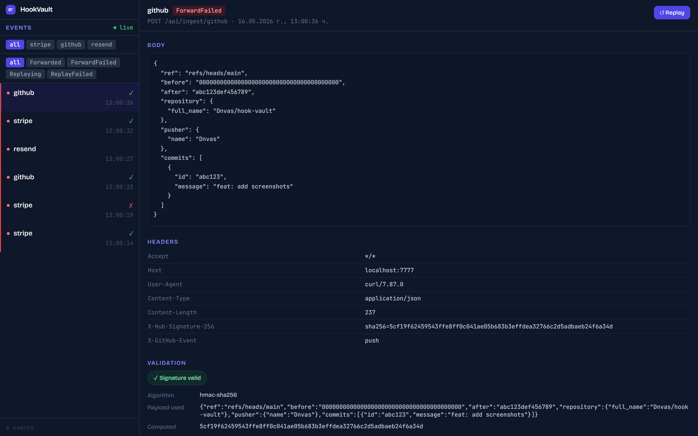
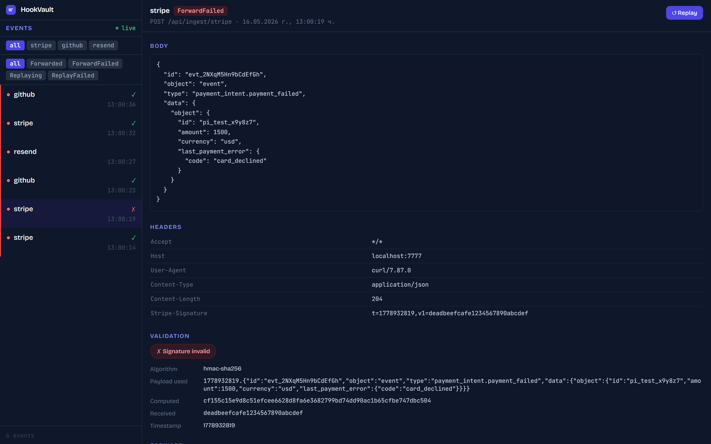

# HookVault

> Capture, inspect, and replay webhooks during local development.

> ⚠️ **Do not expose HookVault to the public internet.** HookVault is a
> local development tool with permissive auth defaults; it expects a
> trusted network. For internet-facing webhook capture, use a hosted
> service.

HookVault is a provider-agnostic webhook proxy for local dev. Drop it into your
docker-compose, point your provider's webhook URL at it, and get full capture,
inspection, and replay — no hardcoded provider logic, no external services, no
code changes to your app.

## Quick Start

**1. Create a config file**

Copy `hookvault.example.json` to `hookvault.json` in your project root and set
your `forwardUrl` and `secretEnvVar` values:

```json
{
  "providers": [
    {
      "name": "stripe",
      "path": "/stripe",
      "forwardUrl": "http://host.docker.internal:3000/webhooks/stripe",
      "validation": {
        "algorithm": "hmac-sha256",
        "secretEnvVar": "STRIPE_WEBHOOK_SECRET",
        "signatureHeader": "Stripe-Signature",
        "payloadFormat": "{timestamp}.{body}",
        "signatureEncoding": "hex",
        "signaturePattern": "v1={signature}",
        "timestampPattern": "t={timestamp}"
      }
    }
  ]
}
```

**2. Set your secrets and start HookVault**

Create a `.env` file alongside `docker-compose.yml`:

```
HOOKVAULT_JWT_SECRET=$(openssl rand -hex 32)
STRIPE_WEBHOOK_SECRET=whsec_...
```

HookVault ships as a multi-arch Docker image (`linux/amd64`, `linux/arm64`).
Pull directly with:

```bash
docker pull ghcr.io/dnvas/hookvault:latest
```

Or run with the bundled `docker-compose.yml` (builds locally from source):

```bash
docker compose up
```

HookVault listens on port `7777` by default.

**3. Point your webhook URL at HookVault**

For Stripe, set the webhook endpoint in your dashboard to:

```
http://localhost:7777/api/ingest/stripe
```

Every webhook hit is now captured, validated, and forwarded to your local app at
the `forwardUrl` you configured.

## How it works

```
Provider (Stripe, GitHub, Resend, …)
         │
         ▼  POST /api/ingest/{provider}
 ┌───────────────────┐
 │     HookVault     │
 │                   │  1. Validates HMAC signature (if configured)
 │                   │  2. Stores event (headers, body, validation result)
 │                   │  3. Forwards to your local app
 └───────────────────┘
         │
         ▼
   Your local app (port 3000, Supabase Edge Function, etc.)

Later — via Management API or Swagger UI:
  • Browse all captured events
  • Inspect headers, body, and validation debug details
  • Replay any event (or bulk-replay all failures)
```

HookVault is a **transparent pass-through proxy**. Your app receives the webhook
exactly as it came from the provider — HookVault just records everything along
the way.

## Why HookVault vs alternatives

| | HookVault | ngrok inspect | webhook.site | smee.io |
|---|:---:|:---:|:---:|:---:|
| Captures the request body | ✓ | ✓ | ✓ | ✓ |
| Replays captured events on demand | ✓ | — | ✓ | — |
| Validates HMAC signatures from config | ✓ | — | — | — |
| Forwards to your local stack | ✓ | ✓ | — | ✓ |
| Runs locally — no third party sees data | ✓ | partial | — | — |
| Provider-agnostic via JSON config | ✓ | — | — | — |
| Multiple webhook providers in one container | ✓ | — | — | — |

HookVault's niche is **provider-agnostic, local-only capture with
config-driven HMAC validation and replay**. It's the only tool in this
list where your provider secrets, captured payloads, and validation
debug output never leave your machine.

## Screenshots





## Configuration

HookVault is configured entirely via `hookvault.json`. No code changes, no
provider-specific logic in the binary.

### Provider fields

| Field | Type | Required | Description |
|---|---|---|---|
| `name` | string | yes | Label used in event listings and logs |
| `path` | string | yes | Ingest path — HookVault registers `POST /api/ingest{path}` |
| `forwardUrl` | string | yes | Where to proxy the event in your local dev stack |
| `validation` | object or null | yes | HMAC config, or `null` to skip validation |

### Validation fields

| Field | Type | Required | Description |
|---|---|---|---|
| `algorithm` | string | yes | `"hmac-sha1"`, `"hmac-sha256"` (default), or `"hmac-sha512"` |
| `secretEnvVar` | string | yes | Name of the env var holding the signing secret (never the secret itself) |
| `signatureHeader` | string | yes | Request header containing the provider's signature |
| `payloadFormat` | string | yes | How the signed string is built — `{body}` and `{timestamp}` are substituted |
| `signatureEncoding` | string | no | `"hex"` (default) \| `"base64"` \| `"base64url"` |
| `signaturePattern` | string | no | Pattern to extract the digest from the header value (e.g. `"v1={signature}"`) |
| `timestampPattern` | string | no | Pattern to extract a timestamp from the same header |

Set `validation` to `null` to capture and forward without any signature checking.

### Capture-only providers

Set `"captureOnly": true` on a provider to persist events without
forwarding them. Useful when your downstream local app is intermittent
or you just want to inspect what arrives. Replays via the UI or API
work normally.

```json
{
  "name": "stripe",
  "path": "/stripe",
  "forwardUrl": "http://host.docker.internal:3000/webhooks/stripe",
  "captureOnly": true,
  "validation": null
}
```

### Disabling auth for single-user local dev

Set `HOOKVAULT_NO_AUTH=true` to skip JWT enforcement on the management
API. A loud warning is logged at startup. Intended only when the
listener is bound to `127.0.0.1`. **Do not enable in any environment
where the port is reachable from outside the host.**

## Provider examples

Ready-to-use configs for common providers are in [`examples/`](examples/):

| File | Provider | Scheme |
|---|---|---|
| [`hookvault.stripe.json`](examples/hookvault.stripe.json) | Stripe | HMAC-SHA256 hex, `{timestamp}.{body}`, `v1=` prefix |
| [`hookvault.github.json`](examples/hookvault.github.json) | GitHub | HMAC-SHA256 hex, body-only, `sha256=` prefix |
| [`hookvault.shopify.json`](examples/hookvault.shopify.json) | Shopify | HMAC-SHA256 base64, body-only, no prefix |
| [`hookvault.resend.json`](examples/hookvault.resend.json) | Resend | No validation (Svix multi-header scheme) |
| [`hookvault.generic-hmac.json`](examples/hookvault.generic-hmac.json) | Template | All options annotated |

## Management API

All management endpoints require a JWT bearer token.

**Generate a token:**

```bash
docker compose run --rm hookvault generate-token
```

Pass it as `Authorization: Bearer <token>` or enter it in the Swagger UI
(`/swagger`, available when `ASPNETCORE_ENVIRONMENT=Development`).

### Endpoints

| Method | Path | Auth | Description |
|---|---|---|---|
| `GET` | `/api/health` | none | Health check — provider list, DB type, event count |
| `GET` | `/api/events` | JWT | List events (filter: `provider`, `status`, `dateFrom`, `dateTo`; paginate: `limit`, `offset`) |
| `GET` | `/api/events/{id}` | JWT | Full event detail — headers, body, validation debug info |
| `POST` | `/api/events/{id}/replay` | JWT | Enqueue a single event for replay |
| `POST` | `/api/events/replay-failed` | JWT | Bulk-enqueue all `ForwardFailed` events |
| `DELETE` | `/api/events` | JWT | Delete all events (optional `?provider=stripe` filter) |

### JWT environment variables

| Variable | Required | Description |
|---|---|---|
| `HOOKVAULT_JWT_SECRET` | yes | HS256 signing secret — generate with `openssl rand -hex 32` |
| `HOOKVAULT_JWT_ISSUER` | no | JWT issuer claim (default: `hookvault`) |
| `HOOKVAULT_JWT_AUDIENCE` | no | JWT audience claim (default: `hookvault`) |

### Database

SQLite is the default (`/data/hookvault.db`, persisted via the `hookvault-data`
Docker volume). To use PostgreSQL, set `DATABASE_URL`:

```env
DATABASE_URL=Host=db;Database=hookvault;Username=hookvault;Password=secret
```

See `docker-compose.postgres.yml` for a ready-to-use PostgreSQL setup.

## Metrics

`GET /metrics` returns Prometheus-format metrics:

- `hookvault_events_total{provider, status}`
- `hookvault_replays_total{outcome}`
- `hookvault_forward_duration_seconds{provider, outcome}`
- `hookvault_retention_deleted_total{reason}`
- `hookvault_signature_validation_total{provider, result}`

Plus standard ASP.NET Core HTTP metrics. The endpoint is unauthenticated.
Scrape it from Prometheus / Grafana Agent / OpenTelemetry collector
running on the same host.

## Development

**Prerequisites:** [.NET 8 SDK](https://dotnet.microsoft.com/download)

```bash
# Build
dotnet build --configuration Release

# Test
dotnet test --configuration Release

# Check formatting
dotnet format --verify-no-changes

# Fix formatting
dotnet format

# Run locally (SQLite, Development mode enables Swagger)
dotnet run --project src/HookVault
```

Swagger UI is available at `http://localhost:5000/swagger` when running in
Development mode.

## License

Apache-2.0 — see [LICENSE](LICENSE).
